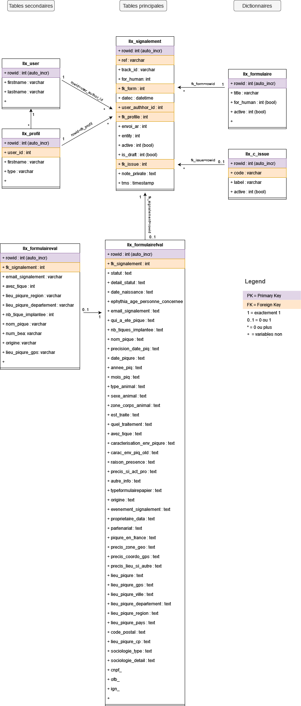

# Diagramme UML

Le diagramme de classes ci-desssous est un diagramme UML permettant de représenter les liens entre les différentes tables utilisées dans la base de données de signalements disponible sous phpMyAdmin. On y retrouve uniquement les tables utiles à l'analyse de données. Pour chaque table, on ne représente également que les variables utilisées pour l'analyse de données dans un soucis de simplification diagramme. Ces données sont considérées "brutes".

  
Ce diagramme permet de comprendre comment a été réalisé le script R de nettoyage des données.

<u>Diagramme de classes de la base de données des signalements</u>

