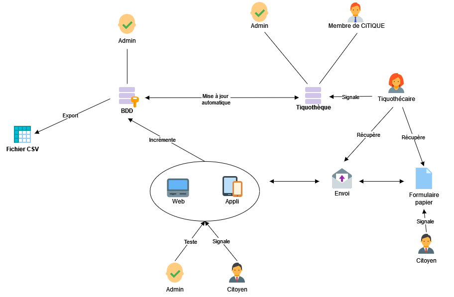

# Organisation et transfert de données

Le diagramme de flux ci-dessous représente les interactions entre les différents modules constiuants le programme CiTIQUE. On y représente les liens entre les différents utilisateurs (interne ou externe) et les outils à disposition (application, site web, tiquothèque, ...). 

  <l><u>Diagramme de flux utilisateurs.</u></l>

