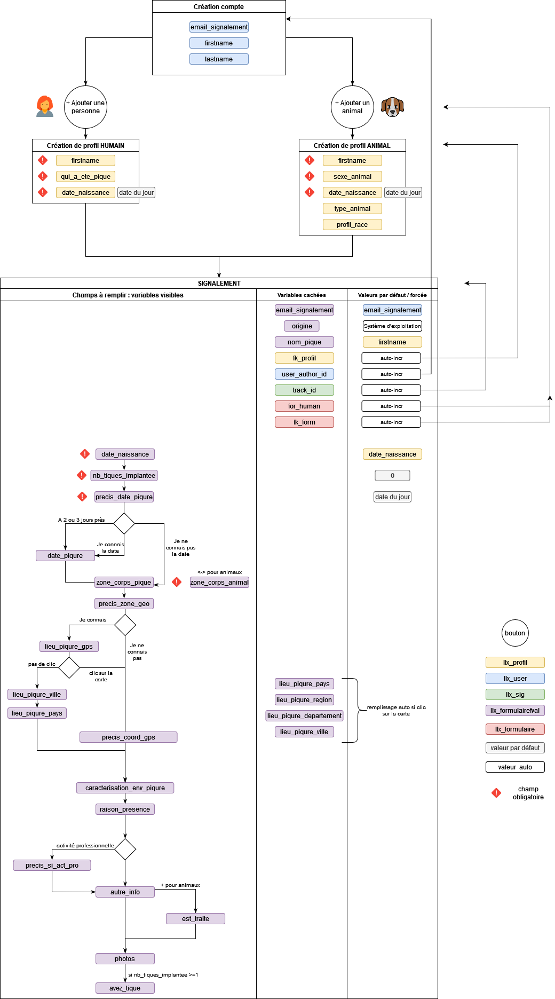

# Signalement par l'application :iphone:

Le diagramme fonctionnel de l'application fournit ci-dessous permet de visualiser les champs proposés actuellement (03/2023) selon les cas (type de formulaire) et notamment les champs obligatoires ou non, les valeurs par défaut, etc.... afin de savoir quels sont les variables actuellement utilisées dans la base de données.

:warning: A mettre à jour à chaque changement dans l'application!

<u> Diagramme des fonctionnalités en cours de l'application </u>

