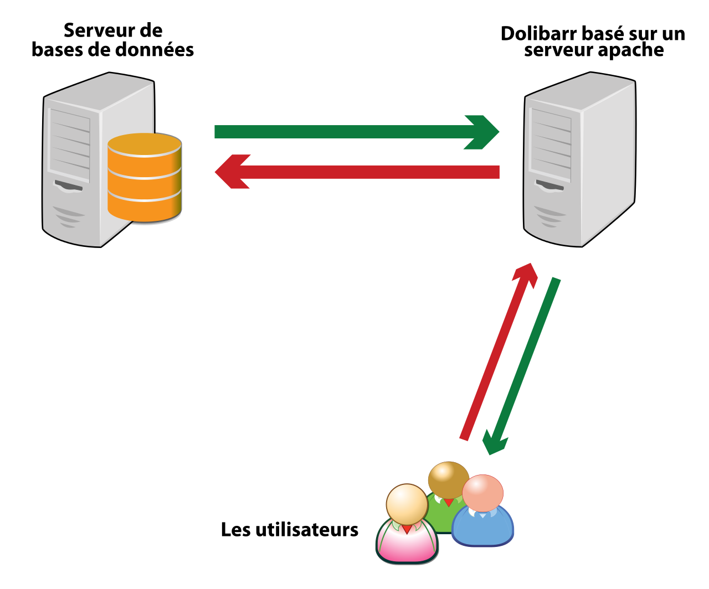

# C'est quoi la tiquothèque ?

La tiquothèque est réalisé sur la base du logiciel libre <a href="https://www.dolibarr.org/">Dolibarr</a>. Dolibarr est un ERP/CRM (Entreprise Resurce Planning / Customer Relationship Managment), <i>ie</i>, un logiciel de gestion d'entreprise. Son utilisation a été adapté afin que la tiquothèque soit une interface utilisateurs permettant de gérer et visualiser les signalements et envois de tiques de manière simplifiée (sans avoir besoin d'utiliser un langage de programmation).

<u>Principe de fonctionnement de Dolibarr</u>

La tiquothèque est développée et maintenue par le [CPIE Nancy Champenoux](https://www.cpie54.com/) et par Mickael Carlavan.

La tiquothèque est accessible à l'adresse www.tiquotheque.fr.
